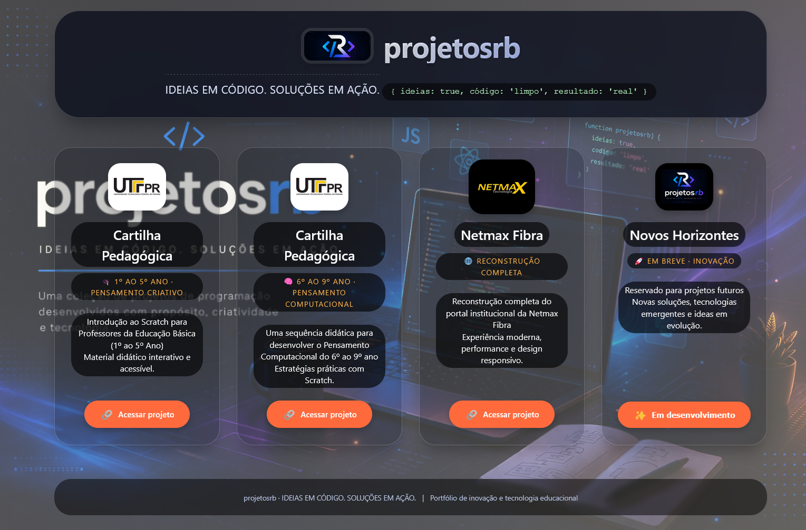

# 🚀 projetosrb · Portfólio de Soluções


> **IDEIAS EM CÓDIGO. SOLUÇÕES EM AÇÃO.**

---

## 📌 Sobre o Projeto

O **projetosrb** é um portfólio web moderno desenvolvido para apresentar projetos de tecnologia e inovação educacional.

Este projeto reúne iniciativas voltadas ao:
- 💡 Pensamento criativo
- 🧠 Pensamento computacional
- 🎓 Educação tecnológica
- 🌐 Desenvolvimento web

---

## 🖥️ Preview



---

## 🧩 Funcionalidades

- 🎯 Interface moderna e intuitiva  
- 📱 Responsividade (mobile-first)  
- ⚡ Alto desempenho  
- 🧱 Código organizado  
- 🔗 Links externos seguros  
- 🖼️ Fallback de imagens  

---

## 🗂️ Estrutura do Projeto

```
projetosrb/
│
├── index.html
├── assets/
│   ├── css/
│   │   └── style.css
│   ├── js/
│   │   └── script.js
│   └── images/
```

---

## 📚 Projetos

| Projeto | Descrição |
|--------|----------|
| 🎓 Cartilha (1º ao 5º) | Introdução ao Scratch |
| 🧠 Cartilha (6º ao 9º) | Pensamento computacional |
| 🌐 Netmax Fibra | Portal institucional |
| 🚀 Novos Horizontes | Em desenvolvimento |

---

## 🛠️ Tecnologias

- HTML5  
- CSS3  
- JavaScript  

---

## ▶️ Como Executar

```bash
git clone https://github.com/seu-usuario/projetosrb.git
cd projetosrb
```

Abra o arquivo:

```
index.html
```

---

## 🌍 Deploy

- GitHub Pages  
- Vercel  
- Netlify  

---

## 📈 Roadmap

- [ ] Modo escuro  
- [ ] Filtro de projetos  
- [ ] Dashboard  
- [ ] Internacionalização  
- [ ] CMS  

---

## 🤝 Contribuição

1. Fork o projeto  
2. Crie uma branch  
```bash
git checkout -b feature/minha-feature
```
3. Commit  
```bash
git commit -m "Minha melhoria"
```
4. Push  
```bash
git push origin feature/minha-feature
```
5. Pull Request 🚀  

---

## 👨‍💻 Autor

**Rodrigo Barbosa**  
📅 2026  

---

## 📄 Licença

Este projeto está sob a licença MIT.

---

## ⭐ Apoie

Se gostou, deixe uma estrela ⭐ no repositório!

---

## 💡 Frase

> “Ideias em código. Soluções em ação.”
